# cob4 Installation automatically with USB/CD/DVD

## Contents

1. <a href="#Introduction">Introduction</a>
2. <a href="#Create Kickstart Configuration file">Create Kickstart Configuration file</a>
3. <a href="#Adding packages, pre-installation, post-installation for Master and Slave configuration files.">Adding packages, pre-installation, post-installation for Master and Slave configuration files.</a>
     1. <a href="#Packages">Packages</a>
     2. <a href="#Pre-Installation Script">Pre-Installation Script</a>
     3. <a href="#Post-Installation Script">Post-Installation Script</a>
4. <a href="#Create Preseed files for Master and Slave configuration files">Create Preseed files for Master and Slave configuration files</a>
5. <a href="#Extract and modify original ISO file">Extract and modify original ISO file</a>
6. <a href="#Recreate ISO file and make bootable USB media">Recreate ISO file and make bootable USB media</a>
7. <a href="#Instructions">Instructions</a>

### 1. Introduction <a id="Introduction"/> 
Automatic software setup for service robots which is also defined as Unattended Installation which is performed on Ubuntu 14.04 Server. The most commonly used methods when it comes to automating Ubuntu installation: Kickstart. The Kickstart is really easy to start with because Ubuntu supports most of the RedHat's Kickstart options and we are going to use some Preseed commands.

In this document we are going to create Kickstart and Preseed configuration files, modify original Ubuntu ISO (Server 14.04) files, save our modified ISO and make USB Startup Disk or CD from it.

### 2. Create Kickstart Configuration file <a id="Create Kickstart Configuration file"/> 

Install Kickstart by typing command into the terminal:
```
sudo apt-get install system-config-kickstart
```
After the installation process is completed, open Kickstart Configuration using Unity search or just by typing
```
 sudo system-config-kickstart
```
in terminal.
When the Kickstart opens, choose the settings you need for your installation. Here is the configuration used.

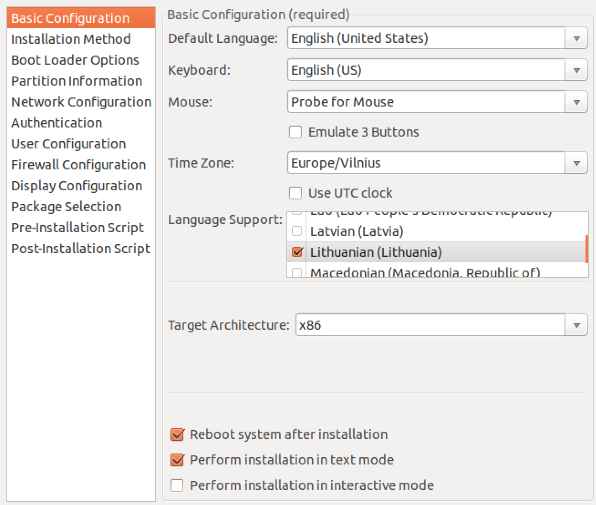
Very basic and self explanatory settings here. We have used x86 architecture, because our devices had less than 4 GB of RAM. 


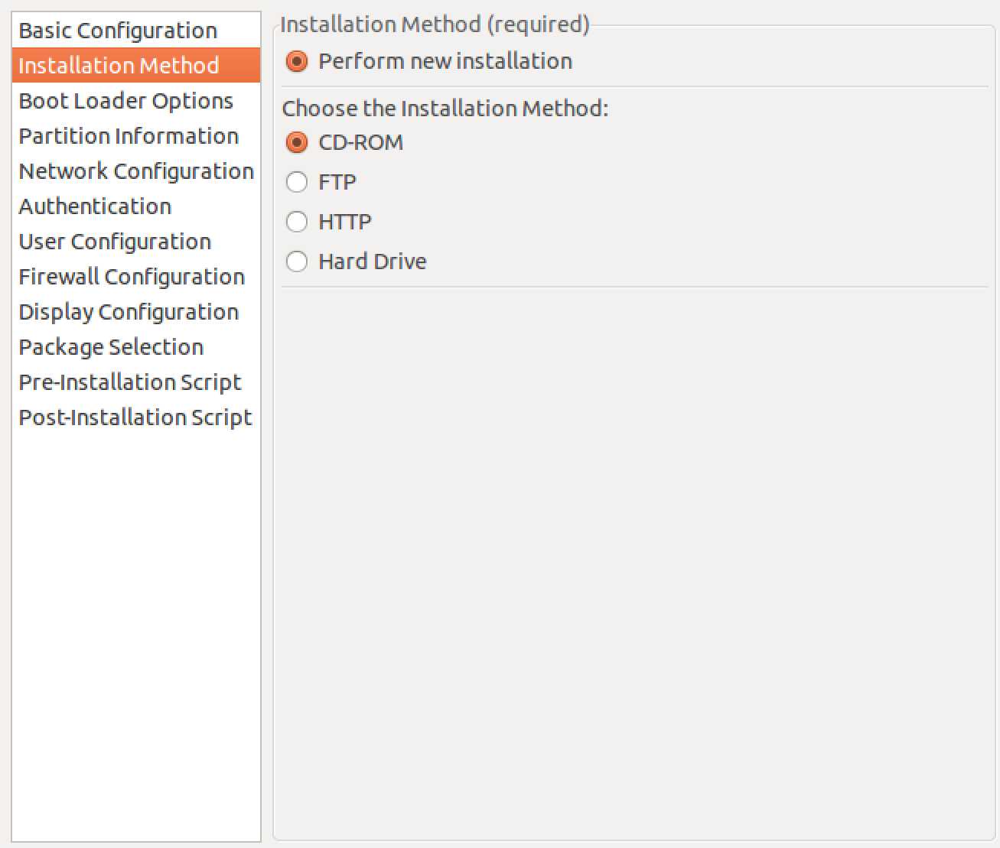
If you want to install Ubuntu from CD-ROM or USB like we did, choose CD-ROM. If you want to install it from ISO file stored on FTP, HTTP servers or hard drive, choose appropriate options. 


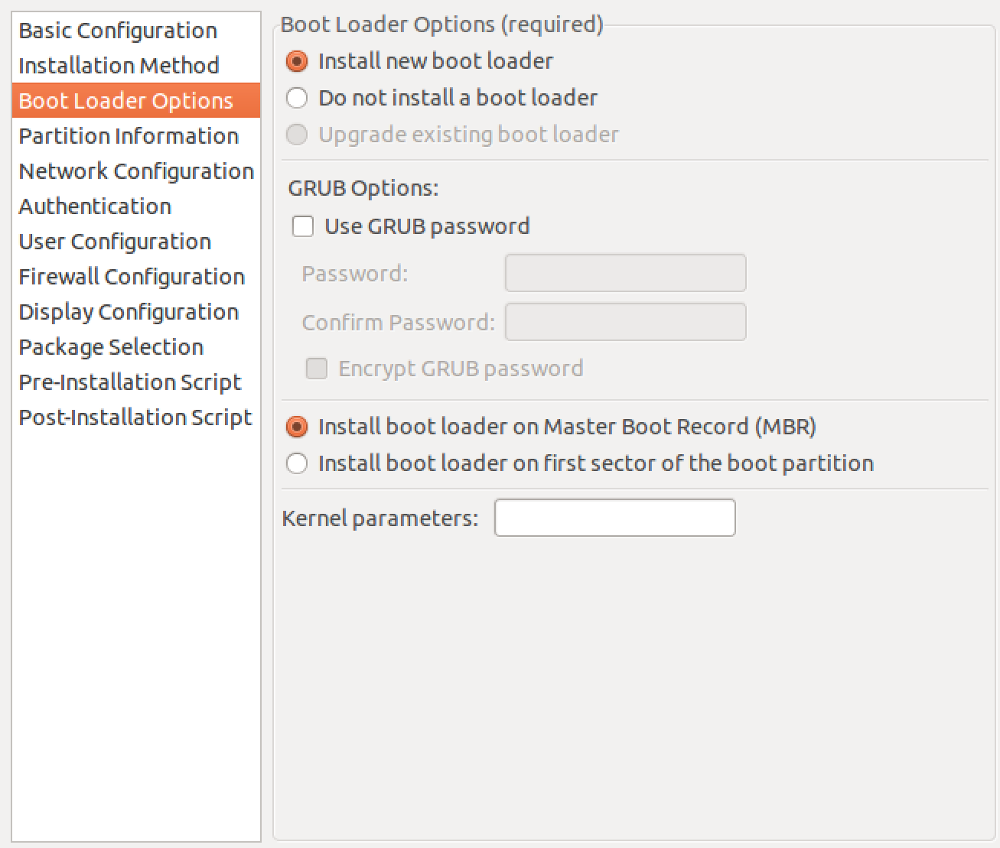
Keep boot loader options to default.


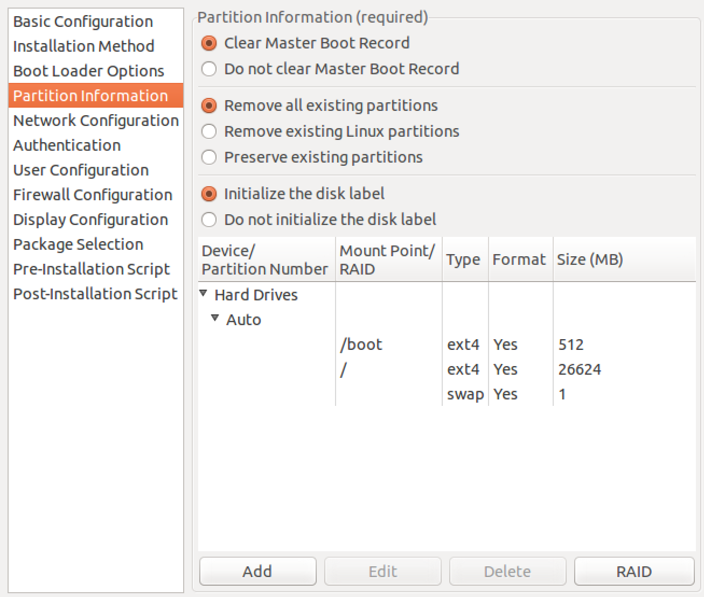
Be careful on this step and set the right partitioning information, because it can completely delete your current system. We have installed Ubuntu on machines that had the same size HDDs with existing partitions. 

Make sure to create /boot, / ,and swap partitions. In this example the first two partitions are in fixed size and the last one is set to fill all remaining space for swap .

Note:  We make some small changes in the partition information in the further settings of kick-start file.


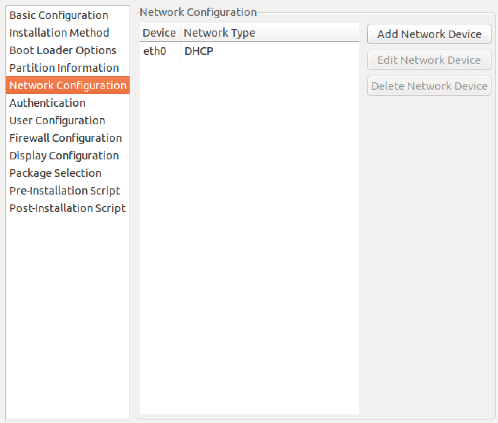
Choose Static or DHCP. 


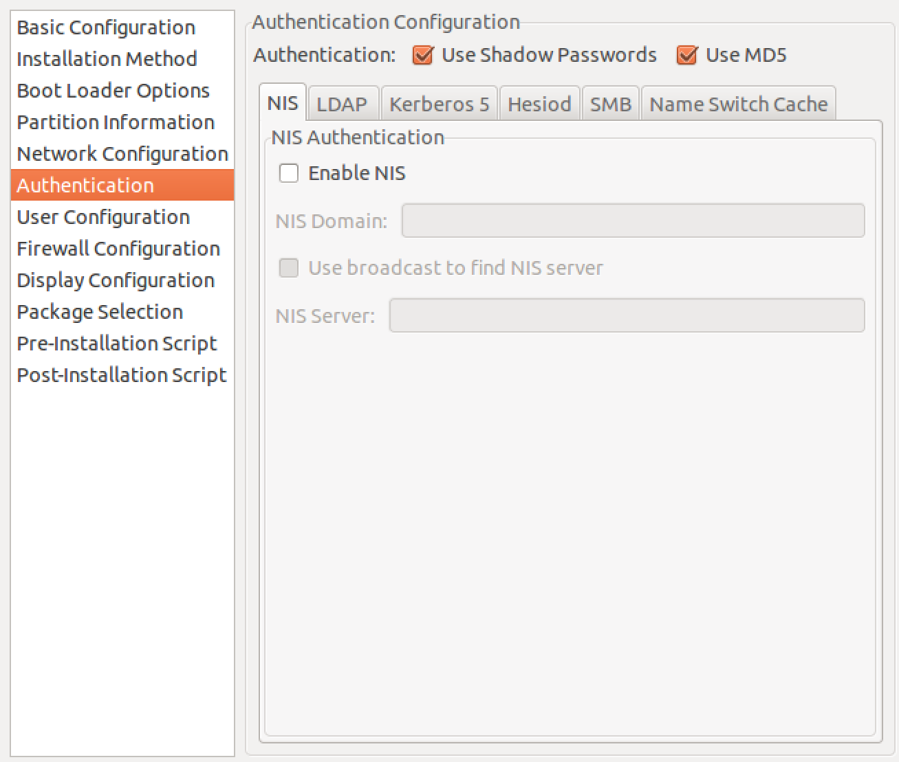
Kept the default settings. 


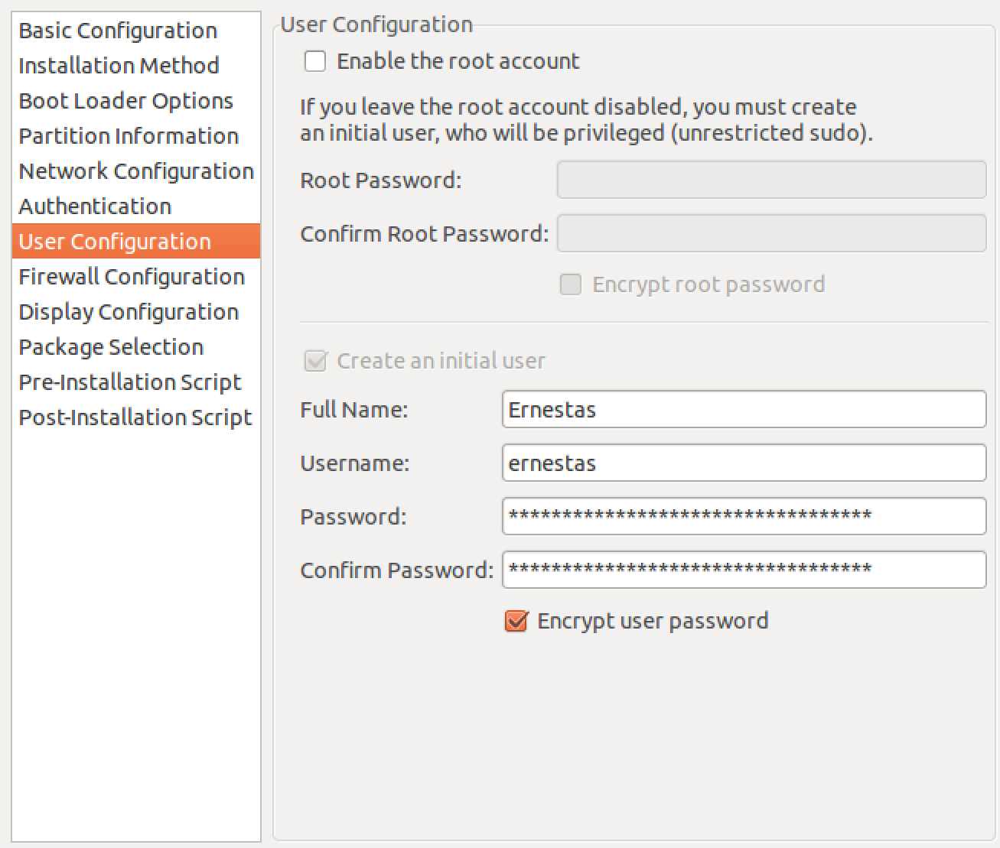
Enter your credentials. You can later change the password in ks.cfg file manually. If you chose to encrypt your password, the supported hash in Kickstart configuration is MD5. Use Open SSL command
```
openssl passwd -1 yourpassword 
```
in Terminal to generate the new password. Place the generated new password in the place of Password and Confirm Password.

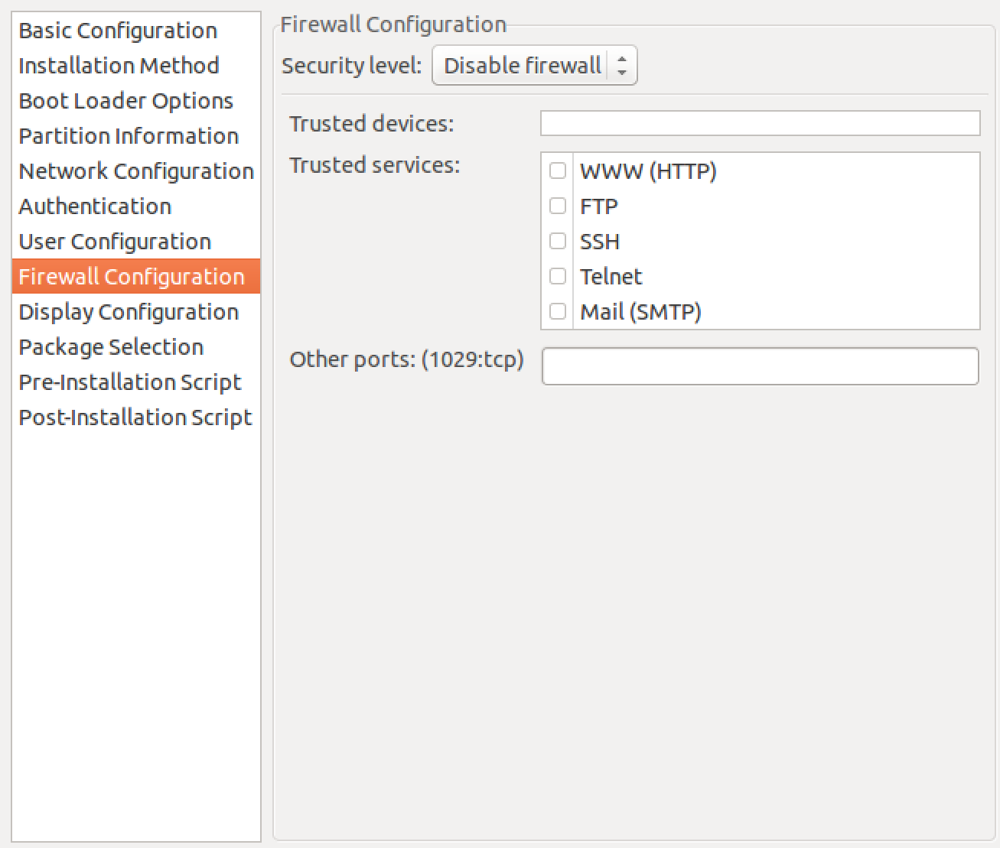
Keep it disabled. Ubuntu doesn't support firewall settings. 


Do not configure the X Window System here. Ubuntu automaticlly solves this one anyway.


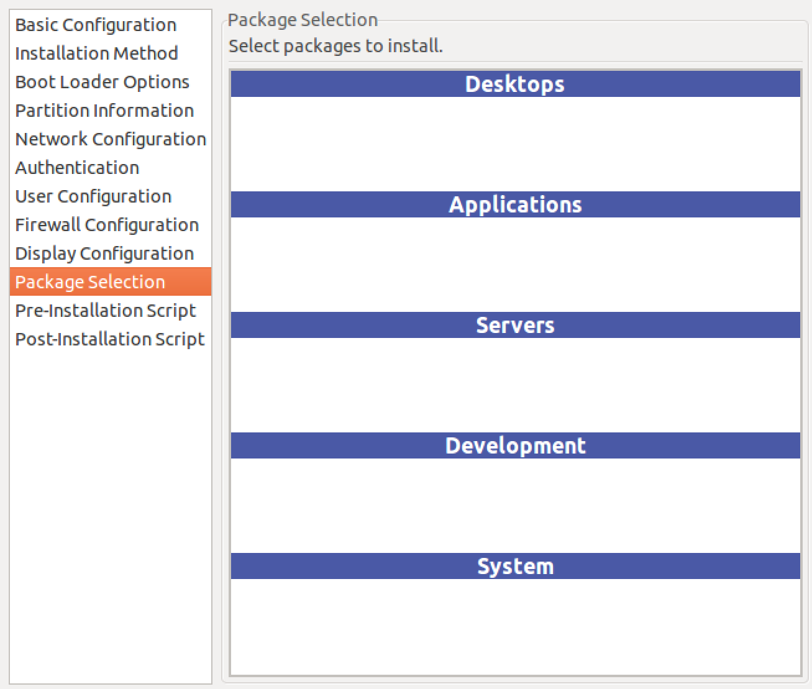
Ubuntu doesn't support Kickstart package selection. We will add them manually %packages section in ks.cfg file.

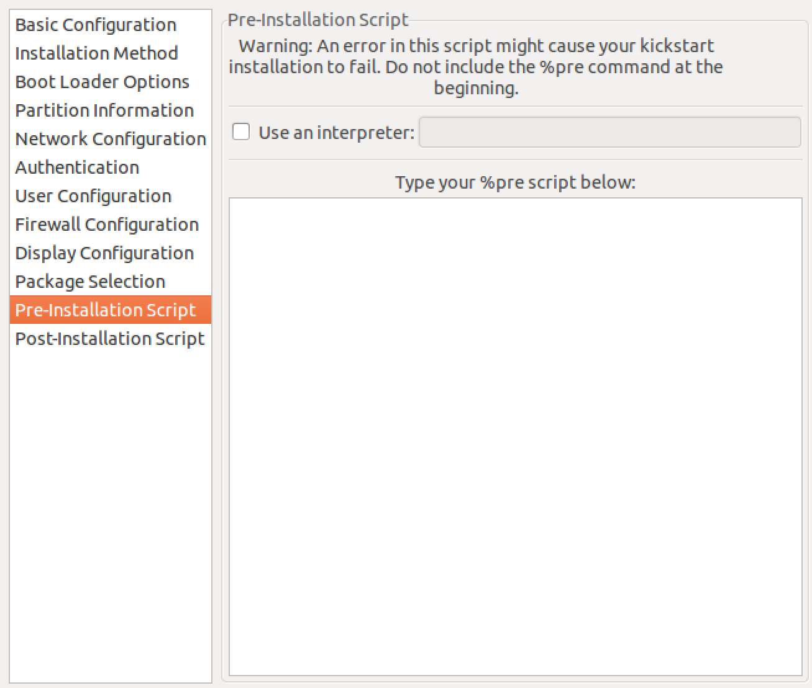
We have some specific per-installation script, we will add manually in %pre section in ks.cfg file.

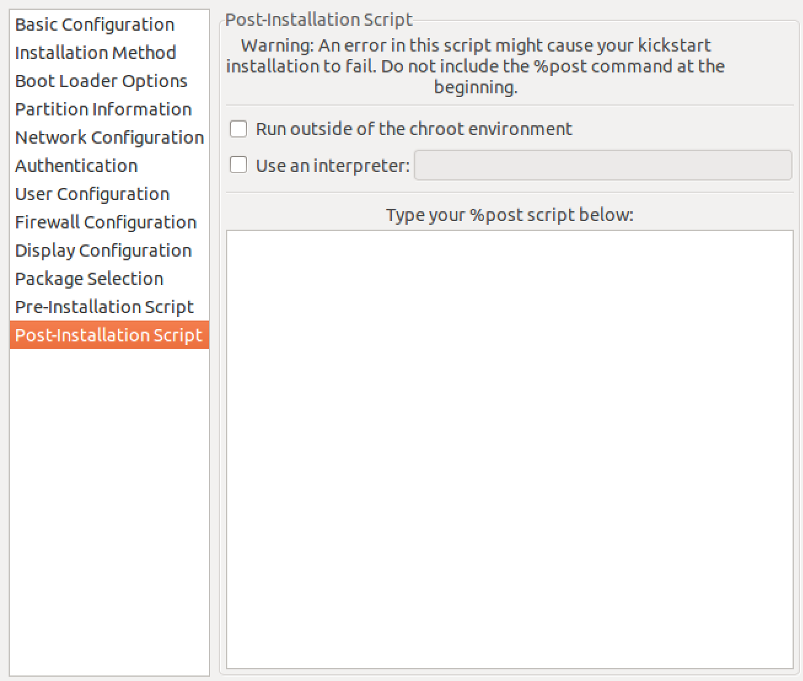
We have some specific post-installation script, we will add manually in %post section in ks.cfg file.


Write anything that you need to do after kickstart installation. It executes the script in chroot environment, so you don't need to use sudo.

When you are finished with the configuration, press File > Save File in the top menu. Keep default name as ks.cfg and save it to your Desktop.

In ks.cfg search for #Disk partitioning information where we are going make small changes in the partition according to our requirement. Remove the lines of partition and paste below mentioned lines.
```
#Disk partitioning information 
##################################################### 
clearpart --all --initlabel 
part /boot --fstype ext4 --size 200 --asprimary 
part swap --size 1024 
part pv.01 --size 1 --grow 
volgroup rootvg pv.01 
logvol / --fstype ext4 --vgname=rootvg --size=1 --grow --name=rootvol 
# needed to answer the 'do you want to write changes to disk" 
preseed partman-lvm/confirm_nooverwrite boolean true 

# needed to answer the question about not having a separate /boot 
preseed partman-auto-lvm/no_boot boolean true 
#####################################################
```
In automatic installation of Care-O-bot we are making two ISO images, one for Slave and one for Master.
Master Machine: cob4-X-b1
Slave Machines: cob4-X-t1, cob4-X-t2, cob4-X-t3, cob4-X-s1, cob4-X-h1

The ks.cfg which is saved on Desktop make copy of same file, name one with ks-robot-slave.cfg and other with ks-robot-master.cfg. Now we have two configuration file by which we can extract two image files one for Master and one for Slave.
### 3. Adding packages, pre-installation, post-installation for Master and Slave configuration files. <a id="Adding packages, pre-installation, post-installation for Master and Slave configuration files."/> 
### a. Packages: <a id="Packages"/> 
Use the %packages command to begin a Kickstart section which describes the software packages to be installed. 
```
Packages for ks-robot-master.cfg:
################################################################################
# Additional packages to install. 
%packages 
vim 
gnome 
tree 
gitg 
git-gui 
meld 
openjdk-6-jdk 
zsh 
terminator 
language-pack-de 
language-pack-en 
ipython
################################################################################
```
```
Packages for ks-robot-slave.cfg:
################################################################################
# Additional packages to install. 
%packages 
vim 
gnome 
tree 
gitg 
git-gui 
meld 
openjdk-6-jdk 
zsh 
terminator 
language-pack-de 
language-pack-en 
ipython 
################################################################################

```


### b. Pre-installation Script <a id="Pre-Installation Script"/> 
We can add commands to run on the system immediately after the kick-start configuration file has been parsed. One must start with %pre command and end with the %end command. The pre-installation script section of kick-start cannot manage multiple installation trees or sources media. This information must be included for each created kick-start configuration file, as the pre – installation script occurs duing the second stage of the installation process.

Here we are using pre-installation script to fetch host name of the machine 
Master Machine: cob4-X-b1
Slave Machines: cob4-X-t1, cob4-X-t2, cob4-X-t3, cob4-X-s1, cob4-X-h1
```
Pre-installation Script for ks-robot-master.cfg:
################################################################################
%pre 
#!/bin/bash 

###Request for hostname######################################### 
exec < /dev/tty6 > /dev/tty6 
chvt 6 
clear 
echo "################################" 
echo "# A Small Request ! #" 
echo "################################" 
echo -n "Enter the name of the machine (hostname): " 
read hostn 
hostname $hostn 
echo -e "NETWORKING=yes\nHOSTNAME=$hostn" > /etc/sysconfig/network 
echo "You have chosen $hostn. Press enter to continue or Ctrl Alt Del to restart" 
read 
###Go back to tty1## 
exec < /dev/tty1 > /dev/tty1 
chvt 1 
################################################################ 
%end
################################################################################


```

```
Pre-installation Script for ks-robot-slave.cfg:

################################################################################

%pre --interpreter=/bin/sh 
#!/bin/sh 

exec < /dev/tty6 > /dev/tty6 2>&1 
chvt 6 
LOGFILE=/tmp/ks-pre.log 

echo "################################" 
echo "# Running Pre Configuration    #" 
echo "################################" 
#presetup script 
CONFIRM=no 
while [ "$CONFIRM" != "y" ] 
do 
echo -n "Give hostname:" 
read HOSTNAME 
if [ "$HOSTNAME" == "" ] 
then 
HOSTLINE="network --device=etho --bootproto=dhcp" 
echo -e -n "\e[00;31mConfigure OS to use DHCP?(y/n): \e[00m" 
read CONFIRM 
else 
echo -n "Give servername:" 
read SERVERNAME 
echo -e -n "Hostname: \e[01;36m$HOSTNAME \e[00m" 
echo -e -n "Servername: \e[01;36m$SERVERNAME \e[00m" 
HOSTLINE="network --device=eth0 --bootproto=static --netmask= --gateway= --nameserver=$SERVERNAME --hostname=$HOSTNAME localhost.localdomain" 
sleep 5 
echo -e -n "Is the above configuration correct?(y/n): " 
read CONFIRM 
fi 
done 
echo $HOSTLINE > /tmp/test.ks 
hostname $HOSTNAME 
2>&1 | /usr/bin/tee $LOGFILE 
chvt 1 
exec < /dev/tty1 > /dev/tty1 
%end
################################################################################

```
### c. Post-installation Script <a id="Post-Installation Script"/> 
We have the option of adding commands to run on the system once the installation is complete. This section must be placed towards the end of the kick-start file, and must start with the %post command and end with the %end command. This section is useful for functions such as installing additional software and configuring an additional name server , editing the files according to our requirement in file system. The post-install script is run in a chroot environment; therefore, performing tasks such as copying scripts or RPMs from the installation media do not work. There can be multiple post installation scripts in one kick-start configuration file.

We are using post-installation to install following list:
1. Install basic tools (vim, meld, terminator, lightdm configuration)
2. Install and configuration openssh
3. Allow robot user to execute sudo command without password
4. Setup root user (in this step the user will be asked for a password)
5. Installing ROS
6. Setup udev rules
7. Setup bash environment
8. Setup NTP
9. Setup NFS
### 4. Create Preseed files for Master and Slave configuration files <a id="Create Preseed files for Master and Slave configuration files"/> 

Preseeding provides a way to set answers to questions asked during the installation process, without having to manually enter the answers while the installation is running. This makes it possible to fully automate most types of installation and even offers some features not available during normal installations.

Pressed commands work when they are directly written inside the kick-start file, but we want to separate the two methods for to see clear boundaries between them. Create new file names ubuntu-auto-robot-master.seed and ubuntu-auto-robot-slave.seed and include following contents in the both the files and save on Desktop.
```
ubuntu-auto-robot-master.seed
################################################################################
# Unmount drives with active partitions. Without this command all the installation process would stop and require confirmation to unmount drives that are already mounted. 
d-i preseed/early_command string umount /media || true 

# Don't install recommended items 
d-i preseed base-installer/install-recommends boolean false 

# Install only security updates automatically 
d-i preseed pkgsel/update-policy select unattended-upgrades 

#d-i live-installer/net-image string http://10.1.1.2/trusty-server-amd64/install/filesystem.squashfs 

d-i partman-auto/method string lvm 
d-i partman-auto-lvm/guided_size string max 
d-i partman-auto/choose_recipe select atomic 
d-i partman-partitioning/confirm_write_new_label boolean true 
d-i partman/confirm_write_new_label     boolean true 
d-i partman/choose_partition            select  finish 
d-i partman/confirm_nooverwrite         boolean true 
d-i partman/confirm                     boolean true 
d-i partman-auto/purge_lvm_from_device  boolean true 
d-i partman-lvm/device_remove_lvm       boolean true 
d-i partman-lvm/confirm                 boolean true 
d-i partman-lvm/confirm_nooverwrite     boolean true 
d-i partman-auto/init_automatically_partition       select      Guided - use entire disk and set up LVM 
d-i partman/choose_partition                select      Finish partitioning and write changes to disk 
d-i partman-auto-lvm/no_boot            boolean true 
d-i partman-md/device_remove_md         boolean true 
d-i partman-md/confirm                  boolean true 
d-i partman-md/confirm_nooverwrite      boolean true 
d-i netcfg/target_network_config string ifupdown
################################################################################
```

```
ubuntu-auto-robot-slave.seed
################################################################################
# Unmount drives with active partitions. Without this command all the installation process would stop and require confirmation to unmount drives that are already mounted. 
d-i preseed/early_command string umount /media || true 

# Don't install recommended items 
d-i preseed base-installer/install-recommends boolean false 

# Install only security updates automatically 
d-i preseed pkgsel/update-policy select unattended-upgrades 

#d-i live-installer/net-image string http://10.1.1.2/trusty-server-amd64/install/filesystem.squashfs 

d-i partman-auto/method string lvm 
d-i partman-auto-lvm/guided_size string max 
d-i partman-auto/choose_recipe select atomic 
d-i partman-partitioning/confirm_write_new_label boolean true 
d-i partman/confirm_write_new_label     boolean true 
d-i partman/choose_partition            select  finish 
d-i partman/confirm_nooverwrite         boolean true 
d-i partman/confirm                     boolean true 
d-i partman-auto/purge_lvm_from_device  boolean true 
d-i partman-lvm/device_remove_lvm       boolean true 
d-i partman-lvm/confirm                 boolean true 
d-i partman-lvm/confirm_nooverwrite     boolean true 
d-i partman-auto/init_automatically_partition       select      Guided - use entire disk and set up LVM 
d-i partman/choose_partition                select      Finish partitioning and write changes to disk 
d-i partman-auto-lvm/no_boot            boolean true 
d-i partman-md/device_remove_md         boolean true 
d-i partman-md/confirm                  boolean true 
d-i partman-md/confirm_nooverwrite      boolean true 
# Primary network interface: 
d-i netcfg/choose_interface select auto 
################################################################################
```
### 5. Extract and modify original ISO file <a id="Extract and modify original ISO file"/> 
Download Ubuntu Server 14.04.5 from Ubuntu website. It is necessary to use server version, because desktop version doesn't support unattested installations. Desktop functionality will be achieved after we install ubuntu-desktop or activate lightdm package in %package section or install in %post installation script.

Mount .iso file to Ubuntu filesystem using terminal. The command below will mount .iso file to the folders named ubuntu_iso_master and ubuntu_iso_slave on our desktop.
And copy .iso contents to another folder on your desktop so we can edit the files. Don't forget to set the right permissions to be able to make changes.
Copy ks-robot-master.cfg and ubuntu-auto-master.seed files to newly created ubuntu_files_slave folder. Copy ks-robot-slave.cfg and ubuntu-auto-slave.seed files to newly created ubutu_files_slave folder.
And Turn off language choice menu and specify your desired language.

For the Master:
```
mkdir ~/ubuntu_iso_master
sudo  mount -o loop ~/Downloads/ubuntu-14.04.5-server-amd64.iso ~/ubuntu_iso_master
cp -r ~/ubuntu_iso_master ~/ubuntu_files_master
chmod +w -R ~/ubuntu_files_master
cp ~/git/setup_cob4/images_config/ks-robot-master.cfg ~/ubuntu_files_master/ks-robot.cfg
cp ~/git/setup_cob4/images_config/ubuntu-auto.seed ~/ubuntu_files_master
echo en >> ~/ubuntu_files_master/isolinux/lang
```

For the Slave:
```
TDB
```

Now we need to make the installer read kickstart and preseed files by including new menu selection for automatic Ubuntu installation. 
To do this, open file ```~/ubuntu_files_master/isolinux/txt.cfg``` or ```~/ubuntu_files_slave/isolinux/txt.cfg``` and copy this block of text after the line default install
```
label autoinstall 
  menu label ^Automatically install of Care-O-bot MASTER 
  kernel /install/vmlinuz 
  append file=/cdrom/preseed/ubuntu-server.seed vga=788 initrd=/install/initrd.gz ks=cdrom:/ks-robot.cfg preseed/file=/cdrom/ubuntu-auto.seed quiet --
```

### 7. Recreate ISO file and make bootable USB media <a id="Recreate ISO file and make bootable USB media"/>
Create new ISO:
For Master:
```
mkisofs -D -r -V "Ubuntu-Auto-Care-O-bot-MASTER" -cache-inodes -J -l -b isolinux/isolinux.bin -c isolinux/boot.cat -no-emul-boot -boot-load-size 4 -boot-info-table -o ~/Ubuntu-Auto-Care-O-bot-MASTER.iso ~/ubuntu_files_master
```
For Slave:
```
TBD
```

### 8. Instructions  <a id="Instructions"/>

1. Create bootable USB media using Ubuntu Startup Disk Creator from newly created Ubuntu-Auto-Care-O-bot-MASTER.iso and Ubuntu-Auto-Care-O-bot-SLAVE.iso files in two different USB sticks.
2. After creating bootable USB media, check the files and folders compare with ubuntu_files folder. For example After creating Master bootable USB media check the files and folders of USB media with ubuntu_files_master folder, due to few permissions isolinux folder will be missing in USB media, we suggest you to copy from the ubuntu_files-master folder and paste in USB media.
3. We can use Disc Burner or k3b applications to burn images in to the CD/DVD to make bootable CD/DVD
4. If you are using new NUC machine we suggest you to start with CD/DVD. Which creates CD-ROM folder.
